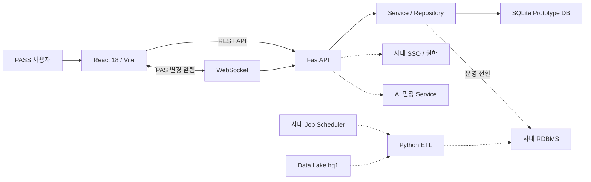

# 아키텍처

## Backend

- `app/main.py`: FastAPI 구성, Router, WebSocket
- `app/auth.py`: Prototype 사용자 컨텍스트와 범위 권한 입력
- `app/database.py`: SQLite 초기화와 샘플 데이터 적재
- `app/routers/pas.py`: PAS CRUD와 파일 관리
- `app/routers/cpms.py`: CPMS 목록, 상세, 담당자 수정
- `app/routers/admin.py`: 컬럼 설정, 로그, 배치 설정
- `app/services.py`: 공통 조회와 감사 로그
- `app/realtime.py`: PAS WebSocket 연결 관리

## Frontend

- `src/App.jsx`: 포털 페이지 전환과 공통 상태
- `src/pages/HomePage.jsx`: 통합 Dashboard
- `src/pages/PasPage.jsx`: PAS Sheet와 실시간 연결
- `src/pages/CpmsPage.jsx`: CPMS Sheet와 Inline Chart
- `src/pages/AdminPage.jsx`: 운영 Dashboard
- `src/components/DataTable.jsx`: 필터, 고정, 이동, 크기 조절, 셀 편집
- `src/services/api.js`: REST와 WebSocket 주소

## 데이터 갱신

- PAS: 기본 1시간 주기
- CPMS: 기본 일 1회
- Prototype은 설정과 샘플 결과를 제공하며 실제 Scheduler 실행은 운영 연동 대상이다.

## Prototype 인증

현재 인증은 `X-User-*` 요청 헤더를 사용하는 데모 컨텍스트다. `TECH_MANAGER`는 `X-User-Scopes`에 포함된 `Product/Tech`만 수정할 수 있다. 이 헤더는 실제 보안 경계가 아니며 운영 전환 시 `app/auth.py` 의존성을 사내 SSO 검증으로 교체해야 한다.
